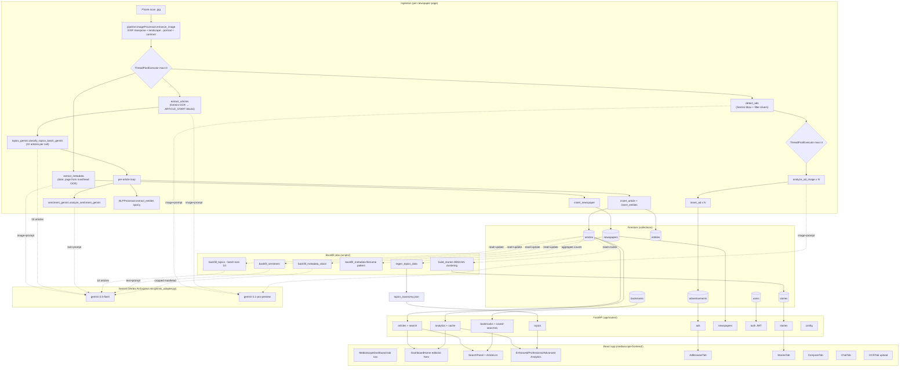

# MediaScope — Codebase Graph

> **Audience:** another LLM (or a new engineer) trying to understand this codebase from scratch in <5 minutes. Optimised for fast lookup of "where does X live and what does it call".

## Mermaid: end-to-end data flow

## File responsibilities — Python backend

### Entry point

| File | LOC | Responsibility | Key entries |
|------|-----|----------------|-------------|
| `app.py` | small | FastAPI app instance, mounts all `/api/*` routers, configures CORS | `app = FastAPI(...)` |

### Services (business logic)

| File | LOC | Responsibility | Key public functions / classes |
|------|-----|----------------|-------------------------------|
| `services/pipeline.py` | ~1500 | Per-page ingestion orchestrator + ImageProcessor + NLPProcessor wrappers | `MediaScopePipeline.process_single_newspaper(image_path)`, `ImageProcessor.{extract_metadata, detect_ads, extract_articles, analyze_ad_image, enhance_image, _prepare_for_gemini}`, `NLPProcessor.{assign_topic, assign_topics_batch, analyze_sentiment, extract_entities}` |
| `services/gemini_adapter.py` | small | Auto-routes between Vertex Express (`AQ.…` keys) and legacy Developer API (`AIzaSy…`) | `create_model(api_key, model_name)`, `describe_key(key)` |
| `services/metadata_vision.py` | ~250 | Crop top-22% of newspaper page, send to Gemini for date+page extraction. Used by `backfill_metadata_vision.py`. | `extract_metadata_from_image(image_source)` returning `{date, page, confidence, reasoning}` |
| `services/topics_gemini.py` | ~370 | Curated topic classifier. Single + **batch** variants. | `classify_topic_gemini(text)`, `classify_topics_batch_gemini(texts, batch_size=10)`, `load_taxonomy()` |
| `services/sentiment_gemini.py` | ~180 | Gemini-only sentiment classifier (replaces RoBERTa for backfills). | `analyze_sentiment_gemini(text)` returning `{label, score, confidence, reasoning}` |

### API routes (`api/routes/*.py`)

| Router | Mount | LOC | Notable endpoints |
|--------|-------|-----|-------------------|
| `articles.py` | `/api/articles`, `/api/search` | 629 | `GET /articles/{id}`, `POST /search/keyword`, `POST /search/entity`, `GET /articles/random`, `GET /articles/on-this-day` |
| `analytics.py` | `/api/analytics` | 703 | `GET /data-version` (versioning + cache key + canonical article count), `articles-over-time`, `top-entities-fixed`, `top-keywords`, `entity-cooccurrence`, `sentiment-over-time`, `topic-distribution`, `keyword-trend`, `entity-sentiment-over-time` |
| `ads.py` | `/api/ads` | 1202 | `GET /browse`, `POST /search`, `POST /upload + /analyze` (manual ad analysis), `GET /newspaper/{id}` |
| `topics.py` | `/api/topics` | 588 | `GET /` (taxonomy + counts), `GET /by-id/{id}`, `GET /{id}/articles`, `GET /trends-over-time`, `GET /sentiment-over-time` |
| `stories.py` | `/api/stories` | 381 | `GET /` (clustered ongoing stories from `build_stories.py`), `GET /{id}` |
| `newspapers.py` | `/api/newspapers` | 547 | `POST /upload` (single page through pipeline), parser entries |
| `auth.py` | `/api/auth` | 197 | `POST /register`, `POST /login`, `GET/PUT /me` (JWT via `JWT_SECRET`) |
| `bookmarks.py` | `/api/bookmarks` | 365 | Per-user bookmarks + saved-searches CRUD |
| `config.py` | `/api/config` | 34 | Env + corpus bounds for the frontend |

### Database

| File | Responsibility |
|------|----------------|
| `database/firestore_db.py` | `FirestoreDB` wrapper + Storage + persistent analytics cache (`.analytics_cache.json`). Singleton via `get_firestore_db()`. Cache key includes article-count version to bust on corpus change. |

### Scripts

| Script | Purpose | Key flag |
|--------|---------|----------|
| `backfill_topics.py` | Re-classify articles into curated taxonomy | `--batch-size 10` (default), `--only-legacy`, `--resume-force` |
| `backfill_sentiment.py` | Score sentiment via Gemini | `--throttle 0.4` |
| `backfill_metadata_vision.py` | Recover date/page from masthead OCR | `--throttle 2.0`, terminal markers `image-corrupted` / `vision-exhausted` |
| `backfill_metadata.py` | Recover date/page from filename pattern + null sentinels | `pass_2_sentinel_nulling` |
| `recut_ad_crops.py` | Re-cut ad crops from parent newspapers (rotates landscape→portrait first) | `--resume-force` |
| `redetect_broken_ads.py` | Re-run `detect_ads` on parents whose ads have garbage coords | groups by parent newspaper |
| `build_stories.py` | DBSCAN cluster articles into ongoing stories | writes to `stories` collection |
| `regen_topics_data.py` | Rebuild `data/topics_data.json` with live counts | clears analytics cache |
| `assign_topics_gemini.py` | Standalone topic assigner (one-shot) | |
| `_call_timeout.py` | 60-second per-call watchdog wrapping any function | `call_with_timeout(fn, *args, timeout=60.0)` |
| `_quarantine_corrupted.py` | One-shot tag image-corrupted parents | |

### Data files

| File | Role |
|------|------|
| `data/topics_taxonomy.json` | **Canonical** 40 curated topics — id, key, label, description, keywords. Source of truth for `topics_gemini.py`. |
| `data/topics_data.json` | Snapshot with live article counts per topic. Regenerated by `regen_topics_data.py`. Read by `/api/topics/`. |
| `data/topic_model*` | Legacy BERTopic artefacts (kept for reference, not used). |

### Utilities

| File | Role |
|------|------|
| `utils/filters.py` | Date parsing + null-aware filter helpers used by API + scripts. |

## File responsibilities — React frontend

### Shell

| File | Role |
|------|------|
| `src/App.tsx` | Router + auth context provider |
| `src/MediaScopeDashboard.tsx` | Top-level shell: tab nav, header, profile, TopEntitiesPanel |
| `src/api.ts` | axios base config |

### Tabs / pages

| File | Tab |
|------|-----|
| `components/DashboardHome.tsx` | **Home** — editorial hero, on-this-day list, stat band, ongoing stories, recent articles |
| `components/SearchPanel.tsx` | Search bar + filters drawer + saved-searches dropdown |
| `components/ArticleList.tsx` | Search results with **density toggle** + zebra striping at compact density |
| `components/EnhancedAnalytics.tsx` | Analytics tab (AnalyticsSummary, TopicDistribution, SentimentDistribution, …) |
| `components/AdvancedAnalytics.tsx` | Power-user analytics |
| `components/ProfessionalAnalytics.tsx` | InteractiveKeywords + InteractiveEntityExplorer |
| `components/AdBrowserTab.tsx` | Browse advertisements with parent-image live-clip fallback |
| `components/StoriesTab.tsx` | Ongoing stories tab |
| `components/CompareTab.tsx` | Side-by-side article comparison |
| `components/ChatTab.tsx` | Ask-AI chat over the corpus |
| `components/OCRTab.tsx` | Upload pipeline UI |
| `components/ImageAnalysisTab.tsx` | Standalone single-ad analysis |
| `components/ArticleDetailPage.tsx` | Article view + related articles + ongoing-coverage rail |
| `components/EntityPage.tsx` | Per-entity dashboard |
| `components/TopicDetailPage.tsx` | Per-topic article list + sentiment/timeline |
| `components/NewspaperBrowser.tsx` | Newspaper-page browser |
| `components/AuthPage.tsx` | Native `<dialog>`-based login/register |

### Reusable widgets / chrome

| File | Role |
|------|------|
| `components/CalendarHeatmap.tsx` | Year-grid article-density heatmap |
| `components/CommandPalette.tsx` | Cmd-K palette |
| `components/UserMenu.tsx`, `ProfilePanel.tsx` | Auth chrome |
| `components/BookmarksPanel.tsx`, `BookmarkButton.tsx` | Per-user bookmarks |
| `components/ShortcutsPanel.tsx` | Keyboard shortcuts cheatsheet |
| `components/SearchResultsSummary.tsx`, `SearchTimeline.tsx` | Result-context widgets |
| `components/ChartExportButton.tsx` | Export Recharts as PNG via html-to-image |
| `components/ui/EmptyState.tsx` | Generic empty-state with Lucide icon prop |
| `components/ui/ErrorBoundary.tsx` | App-level error boundary |
| `components/ui/Skeleton.tsx` | Skeleton loaders |
| `components/ui/Toast.tsx` | Toast hook |
| `components/ui/DateRangePicker.tsx` | Compact date range picker |
| `components/ui/MarkdownLite.tsx` | Lightweight markdown renderer for chat |

### Theme system

| File | Role |
|------|------|
| `theme/components.css` | Reusable primitives: `.card`, `.stat-card / .stat-grid`, `.btn / .btn-group`, `.chip`, `.section-header`, `.empty-state`, `.skeleton`, `.data-table`, `.article-list--compact`, etc. |
| `theme/chartTheme.ts` | Shared Recharts `TOOLTIP_STYLE`, `TOOLTIP_CURSOR`, `AXIS_STYLE` |
| `theme/chartColors.ts` | `chartColors`, `categoricalPalette`, `colorForSentiment` |
| `mediascope-dashboard.css` | CSS tokens (`--space-1..8`, `--font-size-xs..2xl`, `--radius-*`, `--bg-*`, `--text-*`, `--border-*`) + dashboard-shell styles |

### Hooks

| Hook | Role |
|------|------|
| `useAnalyticsCache.ts` | Versioned localStorage wrapper; key = `analytics_<name>_v<articleCount>`. Bust by editing the `<name>` part (e.g. `summary` → `summary_v2`). |
| `useDataVersion.ts` | Polls `/api/analytics/data-version` once per session, returns the article count + corpus date bounds. |
| `useGlobalShortcuts.ts` | Cmd-K + tab navigation shortcuts |
| `useViewHistory.ts` | Tracks recently-viewed articles |
| `useQueryState.ts` | URL search-params binding for filters |

## Key data flows (copy-paste cheat sheet)

### "What happens when a newspaper page is ingested?"

1. `pipeline.process_single_newspaper(image_path)` — entry
2. `Image.open + enhance_image` once (rotates landscape→portrait, EXIF, contrast)
3. `ThreadPoolExecutor(3)` runs concurrently:
   - `extract_metadata(image_path, prepared_image)` → `(date, page)`
   - `detect_ads(page_img)` → list of `{image, bounding_box, text, brand, category}`
   - `extract_articles(image_path, prepared_image)` → list of article dicts
4. `db.insert_newspaper(...)` returns `newspaper_id`
5. `ThreadPoolExecutor(min(4, N))` for `analyze_ad_image` per ad → `db.insert_ad`
6. `classify_topics_batch_gemini(article_texts)` once per page (≈ ⌈N/10⌉ Gemini calls)
7. Per-article loop: `extract_entities` (spaCy local) + `analyze_sentiment` (Gemini) + use batched topic → `db.insert_article + db.insert_entities`

Wall time per page: ~190s on a 12-article 1-ad page (post-batching).

### "How does the dashboard get article count?"

1. Frontend mounts → `useAnalyticsCache('summary_v2', fn)` reads localStorage with key `analytics_summary_v2_v{articleCount}`.
2. If miss → fetch `/api/analytics/data-version` for canonical count → fetch the heavy aggregations → store under the new key.
3. `data-version` returns `{article_count, version, min_date, max_date}` straight from a fast Firestore `count()` aggregation. Rest of analytics is gated by the version field so we don't re-aggregate when nothing changed.
4. Backend keeps a TTL+disk cache (`.analytics_cache.json`); busted by `db_wrapper._clear_analytics_cache()` after backfills write new data.

### "How does a user search?"

1. `SearchPanel` posts `/api/search/keyword` (or `/entity`) with query + filters + sort.
2. Backend filters Firestore by `publication_date` range, `sentiment_label`, `topic_label`, `entity_type`. Substring-match in Python (Firestore doesn't index full-text).
3. Returns `{articles: [...], count}` → `ArticleList` renders cards with density toggle.
4. Clicking an article → `/article/{id}` route → `ArticleDetailPage`.

### "Why is the topic-classifier batched?"

`classify_topics_batch_gemini` sends 10 articles per Gemini call instead of 1. On a text-heavy 13-article page that's ~13 round-trips → ~2. Reduces both wall time AND rate-limit hits. The per-article topic call was the dominant cost in `process_single_newspaper`'s article loop. Wired into both `pipeline.py:process_single_newspaper` and `backfill_topics.py --batch-size 10`.

## Conventions to know

- **Python 3.13**, type hints throughout
- **Resume-safe backfills** — every backfill marks completed docs with a terminal-method flag and skips them on rerun
- **No fabricated defaults** — `(1990-01-01, page=1)` is forbidden; use `null` and let the dashboard show "Unknown"
- **Same Gemini classifier in pipeline + backfill** — `services/topics_gemini.py` is the single source of truth; the backfill imports it
- **CSS tokens before inline styles** — `var(--space-3)`, `var(--font-size-md)` everywhere; never `padding: '12px'`
- **Lucide React for icons** — emoji-as-icon is forbidden ("looks AI-generated" tell)
- **`dialog` element for modals** — not a hand-rolled overlay+card

## Where to start a task

| Task | Start here |
|------|-----------|
| Add a new API endpoint | `api/routes/` — pick the right router or add a new file, mount in `app.py` |
| Add a new ingestion step | `services/pipeline.py:process_single_newspaper` — wire it into the parallel block or the per-article loop |
| Tweak a Gemini prompt | `services/{topics_gemini, sentiment_gemini, metadata_vision}.py` — `_PROMPT_TEMPLATE` constants |
| Add a new analytics widget | `mediascope-frontend/src/components/EnhancedAnalytics.tsx` — wrap data in `useAnalyticsCache(name, fetcher)` |
| Restyle a card | Use `.card`, `.stat-card`, `.section-header`, `.btn` from `theme/components.css` |
| Add a backfill | New `scripts/backfill_*.py`, copy the structure of `backfill_topics.py` (cursor pagination + skip flag + `_call_timeout`) |
| Bust analytics cache | Bump the `name` arg in `useAnalyticsCache(name, fn)` (e.g. `summary` → `summary_v2`) |
| Re-derive topic counts | `python -m scripts.regen_topics_data` |

## Glossary

- **Curated taxonomy** — the 40 fixed topic IDs + labels in `data/topics_taxonomy.json`. Replaced BERTopic.
- **Vertex Express** — Google's lightweight Vertex AI offering. Auth via `AQ.…` keys instead of full GCP service account. Selected automatically by `gemini_adapter.py` based on key prefix.
- **Honest nulls** — date/page fields are `null` when unknown, never fabricated to `(1990-01-01, page=1)`. Pre-existing sentinel defaults are nulled by `backfill_metadata.pass_2_sentinel_nulling`.
- **Terminal method markers** — string flags on Firestore docs that mean "don't re-process": `topic_method='gemini-curated'`, `sentiment_method='gemini'`, `metadata_method ∈ {gemini-vision, image-corrupted, vision-exhausted}`.
- **Legacy label** — a BERTopic-style underscore-joined keyword string (e.g. `mqm_kashmir_ppp_sindh_minister`). Detected by `_LEGACY_RE` in `backfill_topics.py`. Reclassified into curated names on backfill.
- **Outliers** — articles with `topic_id == -1`. Should be near-zero post-backfill (the BERTopic-era 1011 count is being drained as `backfill_topics` reclassifies legacy-labeled articles).
